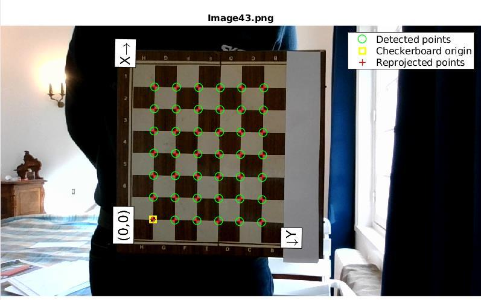
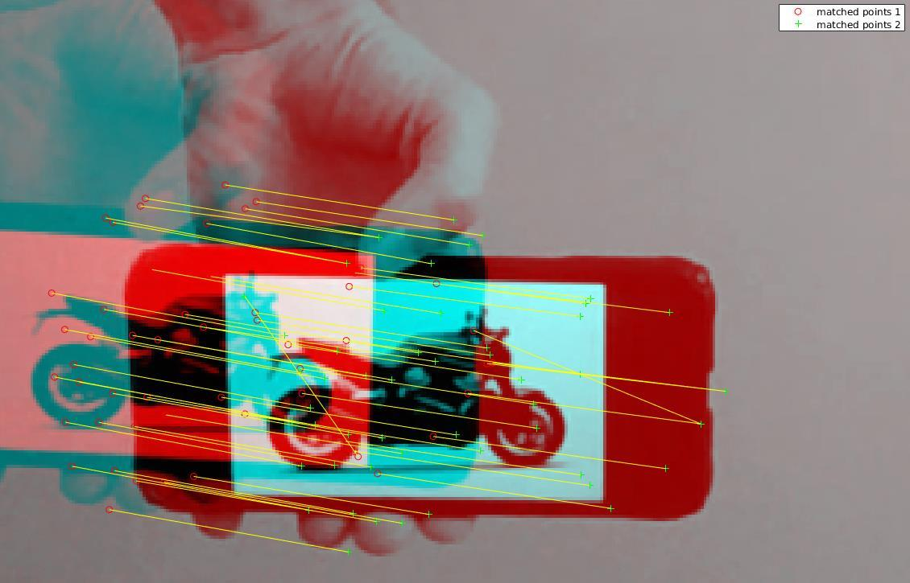
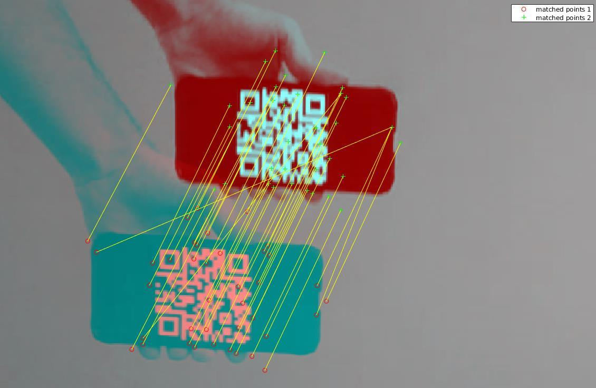
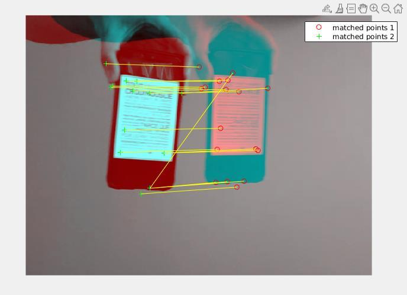
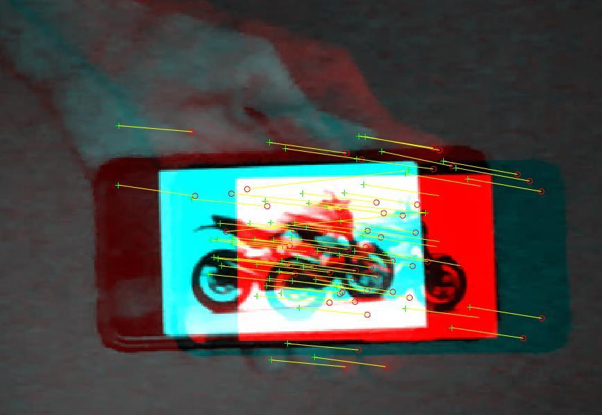
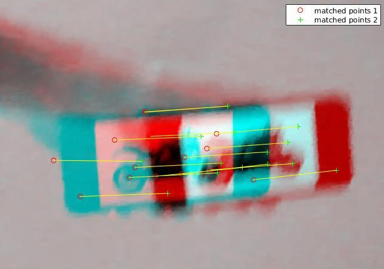

# Project Description

This project aims at computing the trajectory of a filmed object using visual odometry. To achieve it, I am using Matlab and the visual toolbox. This project is based on the Matlab example : Monocular Visual Odometry. However, we seek to compute the trajectory of a moving object, not the trajectory of the camera itself. However, we assume these two trajectories to be linked such that the trajectory of the camera is opposite to the one of the object, meaning that we can deduce one from the other.

# Project pathway

The goal of the project is to evaluate the robustness of this technique depending on the light conditions, and the type of object being tracked.

Here is a look at how I calibrated the camera:

Here is a look at the different objects I am tracking:

A motorcycle:

A QR_code:

A photo of a text:

I am also changing the conditions of the experiment: here are some examples.

In poor light conditions:

Tracking a fast object:

# Conclusions

Even if we are able to compute trajectories, the results obtained are not precise enough to draw satisfying conclusions. This is mainly due to the low quality of the images used. Buying a better quality camera to make new experiments would be a good idea.
Still, this project showed that in theory, it is possible to use monocular visual odometry to track an object.

# References

1. [MATLAB : Monocular Visual Odometry](https://fr.mathworks.com/help/vision/ug/monocular-visual-odometry.html)

2. Martin Peris Martorell, Atsuto Maki, Sarah Martull, Yasuhiro Ohkawa, Kazuhiro Fukui, "Towards a Simulation Driven Stereo Vision System". Proceedings of     ICPR, pp.1038-1042, 2012.

3. Sarah Martull, Martin Peris Martorell, Kazuhiro Fukui, "Realistic CG Stereo Image Dataset with Ground Truth Disparity Maps", Proceedings of ICPR workshop TrakMark2012, pp.40-42, 2012.

4. M.I.A. Lourakis and A.A. Argyros (2009). "SBA: A Software Package for Generic Sparse Bundle Adjustment". ACM Transactions on Mathematical Software (ACM) 36 (1): 1-30.

5. R. Hartley, A. Zisserman, "Multiple View Geometry in Computer Vision," Cambridge University Press, 2003.

6. B. Triggs; P. McLauchlan; R. Hartley; A. Fitzgibbon (1999). "Bundle Adjustment: A Modern Synthesis". Proceedings of the International Workshop on Vision Algorithms. Springer-Verlag. pp. 298-372.

7. X.-S. Gao, X.-R. Hou, J. Tang, and H.-F. Cheng, "Complete Solution Classification for the Perspective-Three-Point Problem," IEEE Trans. Pattern Analysis and Machine Intelligence, vol. 25, no. 8, pp. 930-943, 2003.